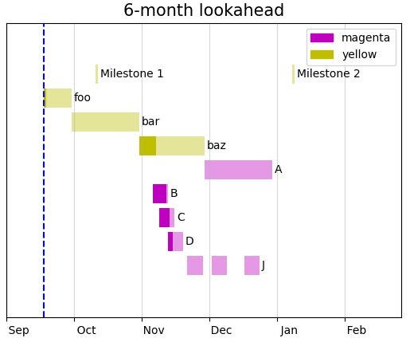

# ganttplay

## Why?

I like to use existing tools as much as possible, but cannot find one that does
what I need, so here is an attempt at hacking one together.

## What?

I need a tool that does the following:

- [x] Produces gantt charts based on text file data
- [x] Supports text file format that sensibly works with basic git workflows
      (so most likely one task per line)
- [x] Generates charts based on data without having to drag/click with mouse
- [x] Optionally renders multiple tasks on the same row
- [ ] Outputs schedules in png format
- [x] Produces plan on a page (because I do not like multiple pages)
- [ ] Supports logic linking of tasks, so that if the start-date or duration is
      changed on one tasks, any other task that is linked to it changes
      automatically
- [ ] Reads a per schedule config file to set start/finish date, style, etc.

It needs to be FOSS and preferably not require massive dependencies.

There is no need for critical path analysis, resource profiling, earned
value, S-curves, network diagrams and so on.

## The Obligatory Screenshot

